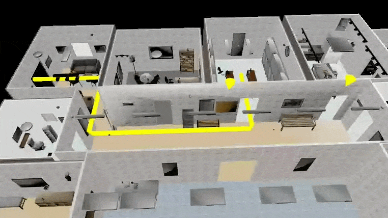
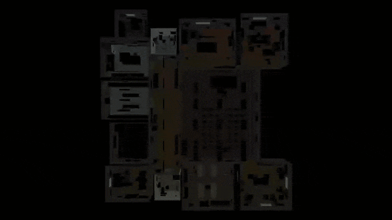

# [Spatial Context Protocol](https://spatialcontextprotocol.github.io/)

> A protocol for AI agents to understand the physical world — enabling LLMs to navigate buildings, identify locations, and control their environment in real time.

## Overview

The [Spatial Context Protocol (SCP)](https://spatialcontextprotocol.github.io/) enables any building to be represented as a compact, LLM-interpretable spatial model. Lightweight enough to run on modest hardware, the model grounds an AI agent in the physical world — giving it native understanding of position, routes, visual landmarks, and live state within a space.

As buildings increasingly expose programmatic interfaces — sensors, lighting systems, access control, climate — SCP provides the layer through which agents natively understand and act within them. Rather than treating building control as a bolt-on integration, SCP unifies spatial reasoning and system control.

An agent can observe live state, answer natural language queries, and operate building systems in real time, without a database or vector store.

> **Key principle:** The spatial model is the only thing that changes between buildings. Author a model for a new location and the same agent is immediately deployable there — no additional infrastructure required.

<figcaption>Fig. 1 — Interactive 3D model of a 13-room multi-functional building used as demonstration. Generated from scratch using a single text prompt with <a href="https://spintel.spatial-intelligence.co.uk/" target="_blank" rel="noopener noreferrer">Spintel</a> — a text → 3D scene generation pipeline from <a href="https://spatial-intelligence.co.uk/" target="_blank" rel="noopener noreferrer">Spatial Intelligence</a>.</figcaption> 

## Examples

Three examples using the 13-room building shown above, each demonstrating a distinct capability of the SCP agent.

### Example 1 — Natural language wayfinding

> **Query:** *"How do I get from the entrance to the changing room?"*

> **Response:** *"From the entrance lobby, walk north through the opening in the north wall and follow the corridor to the main junction. At the junction, take the third doorway from the south — between the orange noticeboard and the kitchen door — into the changing room. Total distance: 13.9 m."*

<figcaption>Fig. 2 — The yellow route line traces the entrance → junction → changing room path provided by the AI agent. Yellow arrows mark the three landmarks referenced in the agent's directions: the orange noticeboard, the kitchen door, and the changing room entrance.</figcaption> 

The agent traverses the building as a human would, identifies the two-hop route, and produces turn-by-turn directions with named landmarks. No pre-computed routes — real-time traversal of the spatial model underpins the system, enabling deployment across multiple venues.

 

---

 

### Example 2 — Location identification from description

> **Query:** *"I'm not sure where I am. I can see grey metal lockers and a bench running down the middle of the room."*

> **Response:** *"You are in the **Changing Room** — identified from the grey metal lockers lining the north and south walls and the benches running down the centre. Exit route: east → corridor junction → south → entrance lobby. ~14 m."*

<figcaption>Fig. 3 — The changing room, identified by the agent by matching the natural language description alone against its lightweight spatial model.</figcaption> 

The agent matches a natural language description against its spatial model, identifies the room without being told where the user is, and offers directions to the exit. The same mechanism handles intent-based queries: "where can I find somewhere quiet to work?"

 

---

 

### Example 3 — Route-conditioned building control

> **Query:** *"It's dark in here. Find me a path to the lounge. Turn on lights for every room I'll pass through."*

> **Response:** *"Route: entrance lobby → main corridor → briefing room → lounge.*
>
> *Lights activated: entrance lobby → corridor → briefing room → lounge."*

<figcaption>Fig. 4 — The agent traverses the building in real time to find a path to the lounge, activating lights room-by-room as it plans the route.</figcaption> 

The agent traverses the building in real-time, reasoning step-by-step about live state. It interacts with the building control layer to activate lights as it passes through rooms. Live state and system control flow through the same underlying spatial model.

 

---

 

## Building the spatial model

A building is described to the system from simple inputs — a walkthrough video, photographs, or a basic floorplan. The generated spatial model is compact, human-readable, and maintainable without specialist tooling.

> The spatial model is the only thing that changes between buildings — making SCP deployable at scale across any venue, without bespoke engineering.

 

---

 

| **01 — INPUTS · Simple source materials** | **02 — MODEL · Compact spatial model** | **03 — DEPLOY · Immediate deployment** |
| --- | --- | --- |
| A walkthrough video, photographs, or an existing floorplan. No specialist survey equipment or BIM software required. | Human-readable model encoding rooms, routes, landmarks, and live system state. Authored once, maintained without specialist tooling. | Same agent, any building. Swap the spatial model to deploy to a new venue — no additional infrastructure or bespoke engineering. |

 

---

 

SCP spatially grounds AI agents for the first time — enabling them to assist with genuinely 3D tasks, and marking **a step toward agents that can inhabit and operate autonomously in the physical world.**

[Spatial Context Protocol (SCP)](https://spatialcontextprotocol.github.io/)
